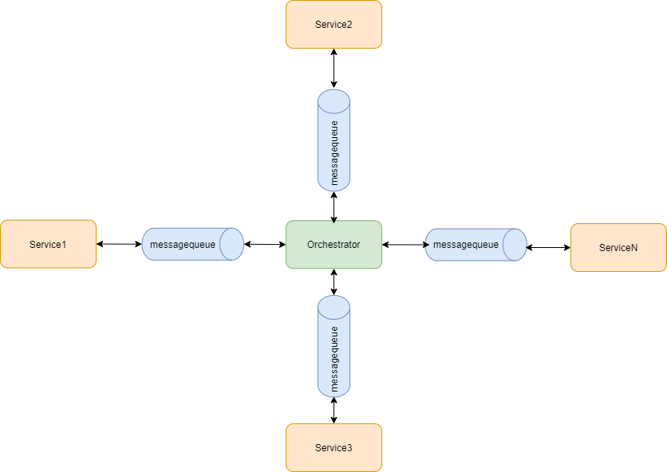

## ``orchestrator`` - convenient configuration of interaction between services in a microservice architecture

### Installation

```commandline
git clone https://github.com/Shchusia/orchestrator.git
python setup.py install
```

### Problem

The application has a lot of service to perform tasks. Each service performs its own task.
Different service bundles are used to perform different tasks.

<u>Example:</u>

Task | Service execution sequence 
--- | --- 
*Task1* | service1 -> service2 -> service3
*Task2* | service2 -> service4 -> service1
*...* | ...
*TaskN* | service3 -> service2 -> ... -> serviceM

In order to centrally control the permissible sequence of execution of services for different tasks, we offer you an orchestrator.



<u>Pros:</u>
* centrally control
* easy expansion
* easy setup
* reuse of services in different tasks

<u>What is needed to be implemented in current architectures</u>
* add a `source` to messages (the name of the service to which the corresponding block in the orchestrator should be)
* add a `flow` to messages (similarly as the source)
* redefine blocks for the desired type of queue

[more details in examples](./examples/README.MD)
